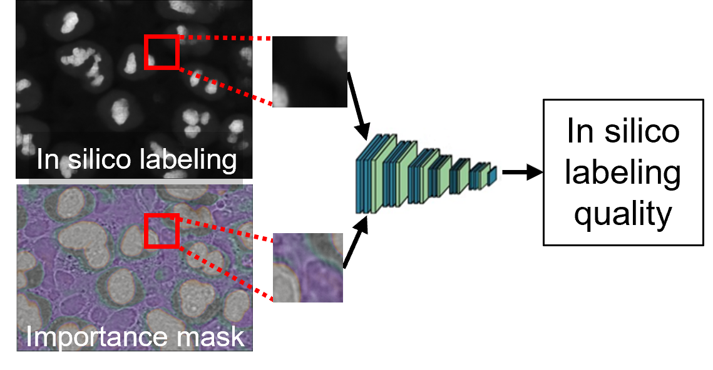

# Confidence Prediction for In-Silico Labeling



[Paper / preprint](#)

---

## Project Description

This repository hosts two tightly related but **separable** projects:

- **`interpretability/`** — Patch level confidence model for in silico labeling with detailed analysis pipelines.
- **`single_cell/`** — Single-cell model for in silico labeling prediction and visual explanation generation.  

Each folder has **its own Python environment** and **paths/configs**. Keep them isolated.

In addition, this repository is part of a research paper done by the Zaritsky Lab of Computational Dynamics that is set to be published. This research is done in collaboration with Lion Ben Nedava and his work can be found here: https://github.com/lionben89/cell_generator/tree/MaskInterpreter2.0.

### Brief research & code overview

- **Goal**: Quantify confidence for in silico labeling predictions and provide a tool for for deciding which predictions are reliable for biological analysis.  
- **Significance**: Improves trust and deployment of in silico labeling in biological imaging by telling **where** and **why** a prediction is reliable.  
- **Key features**
  - *3D confidence model* that ingests in silico labeling predictions + explanation masks and regresses a per-cell/per-patch quality/error target.
  - *Detailed analysis* to understand cell-level or FOV-level mistakes.
  - *Example applications* that can be performed using this method.
---

## Structure  & Necessary Folders (TODO)

## Data (TODO)

- **`interpretability/` dataset**  
  - Paired unlabeled→labeled microscopy volumes for in silico labeling (e.g., brightfield → fluorescence).  
  - Trained to produce **importance masks** explaining in silico labeling predictions; supports 2D/3D.  

- **`single_cell/` dataset**  
  - 3D **z-stacks**, per-cell patches (e.g., 128×128 XY), targets derived from correlation/quality metrics.  
  - Typical sample contains: prediction volume, (optional) importance mask volume, and per-cell target(s).  

---

## Quick Start

```bash
# Clone the repository
git clone https://github.com/GadMil/Interpretability
cd Interpretability

# --- Confidence model ---
cd ../interpretability
conda create -n confidence python=3.10.14
conda activate confidence
pip install -r requirements.txt

# --- Single-cell model ---
cd single_cell
conda create -n single_cell python=3.9.15
conda activate single_cell
pip install -r requirements.txt
```

---

## Citation & Credit (compact) TODO

If you use this **code** or **data**, please **cite** the associated paper and this repository.

**BibTeX (repo):**
```bibtex
@misc{isl_confidence_repo,
  title        = {ISL-Confidence: Single-Cell Confidence & Interpretability for In-Silico Labeling},
  author       = {Your Name and Collaborators},
  year         = {2025},
  howpublished = {\url{https://github.com/<org>/<repo>}}
}
```

**BibTeX (paper/preprint placeholder):**
```bibtex
@article{isl_confidence_paper,
  title   = {Quantifying Uncertainty in In-Silico Labeling via Single-Cell Confidence and Mask-Based Interpretability},
  author  = {Your Name and Collaborators},
  journal = {Preprint},
  year    = {2025}
}
```

---

## Repository Layout

```
.
├─ README.md                # (this file)
├─ README_Figures/                  # figures used by README (e.g., overview.png)
├─ single_cell/             # single-cell confidence model
└─ interpretability/        # mask-based interpretability
```

---

**License & Contact**  
See `LICENSE` in main folder. For questions or collaboration, open an issue or contact...
